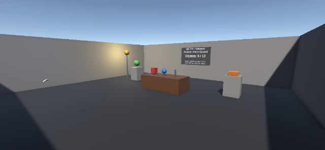
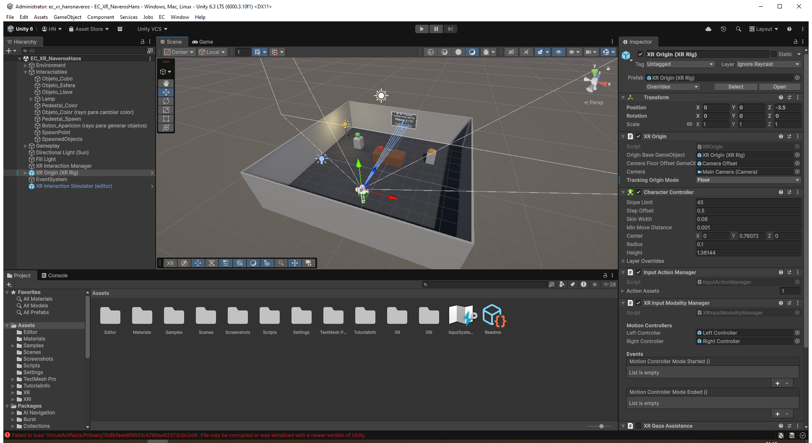
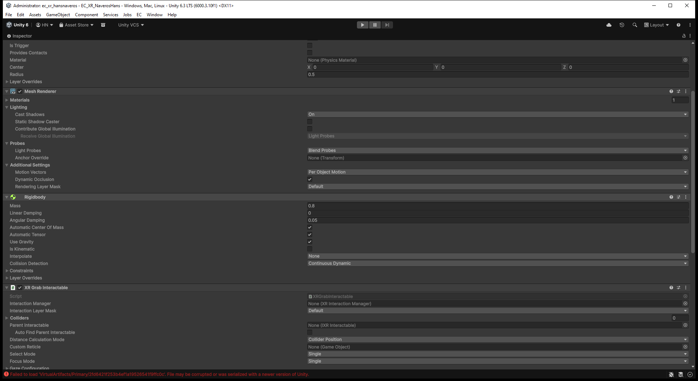
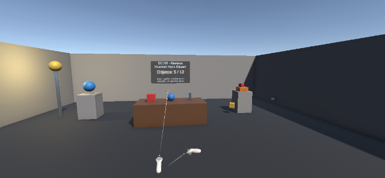

# EC_XR_NaverosHans — XR Interaction Challenge

Experiencia interactiva de **realidad virtual** desarrollada en **Unity 6.3 LTS (6000.3.10f1)** con
**URP** y **XR Interaction Toolkit**, como evaluación de conocimientos del curso
*Laboratorio de Realidad Extendida (XR) para Videojuegos*.

---

## Datos del estudiante

| Campo | Valor |
| --- | --- |
| **Apellidos y nombres** | Naveros Huaman Hans Eduard |
| **Código de estudiante** | 2221899148 |
| **Curso** | Laboratorio de Realidad Extendida (XR) para Videojuegos |
| **Docente** | Victor Alejandro Arroyo Castro |
| **Modalidad** | Individual |
| **Escena principal** | `Assets/Scenes/EC_XR_NaverosHans.unity` |

---

## Descripción del proyecto

Se construyó una **sala de entrenamiento XR** con límites visuales, iluminación propia y objetos 3D,
pensada para demostrar la configuración correcta de un proyecto XR y tres tipos de interacción:

1. **Manipulación directa** de objetos con física (agarrar, sostener y lanzar).
2. **Interacción a distancia** con el rayo del controlador (encender/apagar una luz y cambiar el color
   de un objeto sin tocarlo).
3. **Reto libre:** un generador de objetos que instancia primitivas 3D agarrables con física y lleva el
   conteo en una **interfaz espacial** (UI en el espacio 3D), además de una zona de **teletransporte**.

El escenario se puede probar **sin visor** usando el **XR Interaction Simulator** incluido en el editor.

---

## Capturas de pantalla (evidencias)

### 1. Vista general del escenario



### 2. Configuración XR — componente `XR Origin` en el Inspector



### 3. Componentes de física e interacción — `Rigidbody` + `XR Grab Interactable`



### 4. Interacción funcionando — generador de objetos y contador en UI espacial



---

## Funcionalidades implementadas

| # | Requerimiento de la rúbrica | Implementación en el proyecto |
| --- | --- | --- |
| 1 | Configuración del proyecto XR | Unity 6.3 LTS + **URP**, **XR Plug-in Management** con **OpenXR** habilitado para *Standalone*, **XR Interaction Toolkit 3.6.1**, **XR Interaction Manager**, `EventSystem` con `XRUIInputModule` y samples *Starter Assets* + *XR Interaction Simulator*. |
| 2 | Escenario XR | Escena propia `EC_XR_NaverosHans`: piso, **4 paredes** como límites visuales, **techo abierto** para visibilidad, luz direccional + luz de relleno, iluminación ambiental y **8 objetos 3D** (mesa, cubo, esfera, cilindro, esfera de color, lámpara, 2 pedestales). |
| 3 | Manipulación de objetos | **3 objetos agarrables** (`Objeto_Cubo`, `Objeto_Esfera`, `Objeto_Llave`) con `Rigidbody` + `XRGrabInteractable` + collider, con lanzamiento al soltar (`throwOnDetach`). |
| 4 | Interacción a distancia (rayo) | Ray Interactor en ambos controladores: **(a)** `Objeto_Color` cambia de color al seleccionarlo con el rayo (`ECColorCycler`); **(b)** `Lamp_Head` enciende/apaga su luz al seleccionarla (`ECLightToggle`). |
| 5 | Reto libre | **Aparición de objetos** (`ECObjectSpawner`): cada activación con el rayo genera un objeto 3D agarrable con física; el **contador de UI espacial** muestra `Objetos: N / 12` y al alcanzar el límite la siguiente activación limpia la zona. Incluye **zona de teletransporte** (`TeleportationArea`). |
| 6 | GitHub + README | Repositorio **público** con este `README.md`, capturas de evidencia y enlace al video demostrativo. |

---

## Controles / instrucciones de uso

### Sin visor (probando en el Editor de Unity)

1. Abrir el proyecto con **Unity 6.3 LTS (6000.3.10f1)**.
2. Abrir la escena `Assets/Scenes/EC_XR_NaverosHans.unity`.
3. Pulsar **Play**. El simulador de XR se carga solo (ya está en la escena).

**Teclas del XR Interaction Simulator** (tomadas de
`Assets/Samples/XR Interaction Toolkit/3.6.1/XR Interaction Simulator/*.inputactions`):

*Tomar el control de los mandos*

| Tecla | Acción |
| --- | --- |
| `[` (corchete izq.) | Toma / suelta el **mando izquierdo** |
| `]` (corchete der.) | Toma / suelta el **mando derecho** |
| `[` + `]` seguidos | Deja activos **ambos** mandos |
| `H` | Toma / suelta solo la **cabeza** (HMD) |
| `Tab` | Cicla entre modo FPS (cabeza + mandos) y modo dispositivo |
| `X` / `Y` | Menú de acciones / menú de selección de dispositivo |

> Si se pulsa `[` o `]` **dos veces seguidas** se alterna entre modo *Controller* y modo *Hand*.
> Si el mando desaparece y aparecen manos, pulsa la misma tecla dos veces para volver.

*Usar los dos mandos a la vez*

| Tecla | Acción |
| --- | --- |
| `Shift` (mantener) | Mientras se mantiene, `T`, `G`, `1`, `2`… actúan sobre el **mando izquierdo** en lugar del derecho |

> Al cambiar de un mando a otro, los controles que quedaron presionados **siguen presionados**:
> eso permite agarrar o accionar con las dos manos a la vez.

*Apuntar y desplazarse*

| Tecla | Acción |
| --- | --- |
| Mover el ratón | El mando activo **apunta** hacia donde está el cursor |
| `Botón izquierdo del ratón` (mantener) | **Select / Trigger** del mando activo |
| `Botón derecho del ratón` (mantener) + ratón | Rotar la cabeza (HMD) |
| `W` / `S` | Avanzar / retroceder |
| `A` / `D` | Desplazar a la izquierda / derecha |
| `Q` / `E` | Bajar / subir |
| `↑ ↓ ← →` | Rotar el dispositivo activo |
| `I J K L` | Joystick (eje 2D del mando) |
| `R` | Reiniciar la posición del dispositivo activo |

*Acciones del mando*

| Tecla | Acción |
| --- | --- |
| `T` (mantener) | **Trigger** (dispara el rayo: agarra, cambia color, enciende la luz, genera objetos) |
| `G` (mantener) | **Grip** |
| `1` / `2` | Botón primario / secundario |
| `M` | Menu |
| `3` – `8` | Clic / touch de los ejes 2D |
| `` ` `` (backtick) / `Espacio` | Ciclar / ejecutar la *quick action* |

> **Receta rápida:** pulsa `]` para tomar el mando derecho, apunta con el ratón a `Objeto_Color`,
> `Lamp_Head` o `Boton_Aparicion` y mantén `T` (o el botón izquierdo del ratón) para interactuar.
> Si el rayo no engancha, pulsa `R` para recentrar el dispositivo.

### Con visor (build)

- El proyecto está configurado para **OpenXR (Standalone)**. El prefab del simulador
  (`XR Interaction Simulator (editor)`) debe eliminarse de la escena antes de compilar para un visor.

---

## Estructura del proyecto

```
Assets/
├── Editor/
│   └── ECSceneBuilder.cs        # Constructor automático de la escena (menú EC)
├── Materials/                   # Materiales URP/Lit del escenario
├── Scenes/
│   ├── EC_XR_NaverosHans.unity  # Escena principal de la evaluación
│   └── SampleScene.unity        # Escena de plantilla de Unity
├── Screenshots/                 # Capturas usadas como evidencia
├── Scripts/
│   ├── ECColorCycler.cs         # Interacción a distancia: cambio de color
│   ├── ECLightToggle.cs         # Interacción a distancia: encender/apagar luz
│   └── ECObjectSpawner.cs       # Reto libre: aparición de objetos + contador
├── Samples/XR Interaction Toolkit/3.6.1/   # Starter Assets y XR Interaction Simulator
└── XR/                          # Ajustes de XR Plug-in Management (OpenXR)
```

### Regenerar la escena

La escena se puede reconstruir desde cero con el menú superior:

```
EC → Construir escena EC_XR_NaverosHans
```

---

## Tecnologías y paquetes utilizados

- **Unity 6.3 LTS** (`6000.3.10f1`)
- **Universal Render Pipeline (URP)** `17.3.0`
- **XR Interaction Toolkit** `3.6.1`
- **XR Plug-in Management** `4.7.0`
- **OpenXR Plugin** `1.18.0`
- **Input System** `1.18.0`
- **TextMesh Pro** (UI espacial) — parte de `com.unity.ugui` `2.0.0`
- **XR Interaction Simulator** (sample) — simulación de HMD y controladores dentro del editor

---

## Video demostrativo

> 🎬 **Enlace al video:** `PENDIENTE` — reemplazar por la URL del video (máximo 1 minuto).

---

## Notas y solución de problemas

- Al entrar en *Play*, el simulador puede registrar el mensaje
  `Failed to get haptic capabilities of XRSimulatedController...`. Es un **aviso benigno del simulador**
  (no existe hardware con háptica en el editor) y no afecta el funcionamiento de la experiencia.
- Si el rayo no interactúa, verificá que el controlador esté **activo** (`[`, `]` o `[]`) y que en
  *Project Settings → XR Plug-in Management → XR Interaction Toolkit* esté disponible el simulador.
- La carpeta `Library/` **no se versiona**: Unity la regenera automáticamente al abrir el proyecto.
